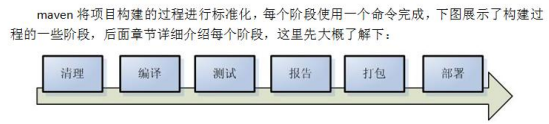

## 1 什么是 Maven

> Maven 是一个项目管理工具，它包含了一个项目对象模型 (POM：Project Object Model)，一组标准集合，一个项目生命周期(Project Lifecycle)，一个依赖管理系统(Dependency Management System)，和用来运行定义在生命周期阶段(phase)中插件(plugin)目标(goal)的逻辑。

## 2 Maven 具体能做什么

### 2.1 依赖管理

传统的 WEB 项目中，我们必须将工程所依赖的 jar 包复制到工程中，导致了工程的变得很大。

> 而maven 工程中不直接将 jar 包导入到工程中，而是通过在 pom.xml 文件中添加所需 jar 包的坐标，这样就很好的避免了 jar 直接引入进来，在需要用到 jar 包的时候，只要查找 pom.xml 文件，再通过 pom.xml 文件中的坐标，到一个专门用于”存放 jar 包的仓库”(maven 仓库)中根据坐标从而找到这些 jar 包，再把这些 jar 包拿去运行。

### 2.2 项目的一键构建

> 我们的项目，往往都要经历编译、测试、运行、打包、安装 ，部署等一系列过程。项目从编译、测试、运行、打包、安装 ，部署整个过程都交给 maven 进行管理，这个过程称为构建。一键构建指的是整个构建过程，使用 maven 一个命令可以轻松完成整个工作。

Maven 规范化构建流程如下：

## 3 Maven 仓库

- 本地仓库 ：用来存储从远程仓库或中央仓库下载的插件和 jar 包，项目使用一些插件或 jar 包，优先从本地仓库查找，默认本地仓库位置在 ${user.dir}/.m2/repository，${user.dir}表示 windows
  用户目录。

- 远程仓库：如果本地需要插件或者 jar 包，本地仓库没有，默认去远程仓库下载。远程仓库可以在互联网内也可以在局域网内。

- 中央仓库 ：在 maven 软件中内置一个远程仓库地址 http://repo1.maven.org/maven2 ，它是中央仓库，服务于整个互联网，它是由 Maven 团队自己维护，里面存储了非常全的 jar
  包，它包含了世界上大部分流行的开源项目构件。
