## idea 的 maven 配置

> 打开FileSettings 配置 maven 依据图片指示，选择本地 maven 安装目录，指定 maven 安装目录下 conf 文件夹中 settings 配置文件。

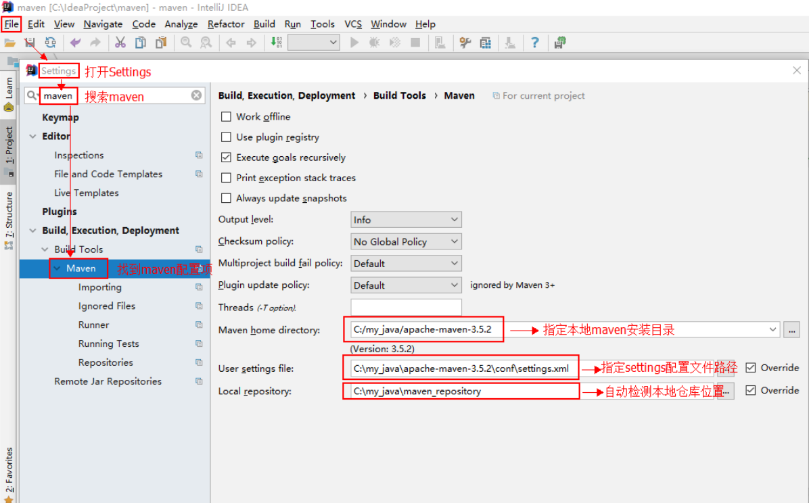

## idea 中创建一个 maven 的 web 工程

### 1.创建新工程

>打开 idea，选择创建一个新工程

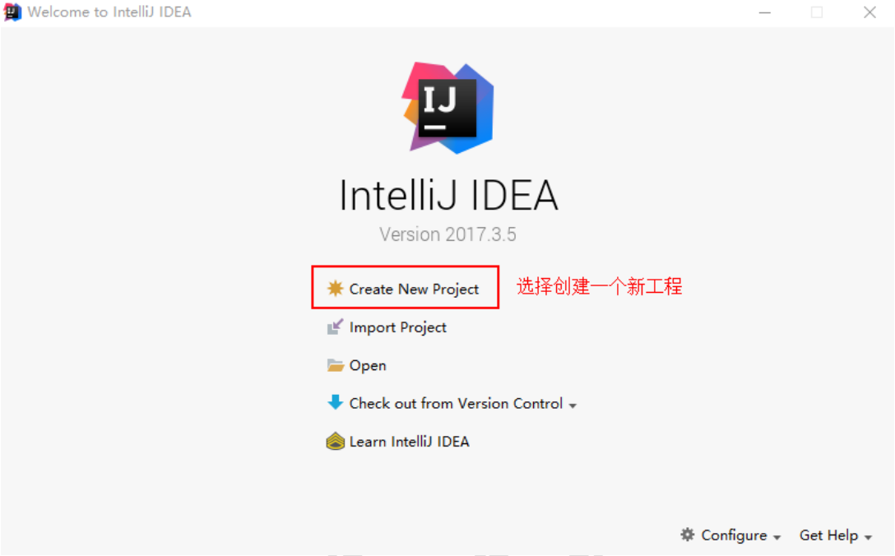

### 2.选择工程模板

> 选择 idea 提供好的 maven 的web 工程模板

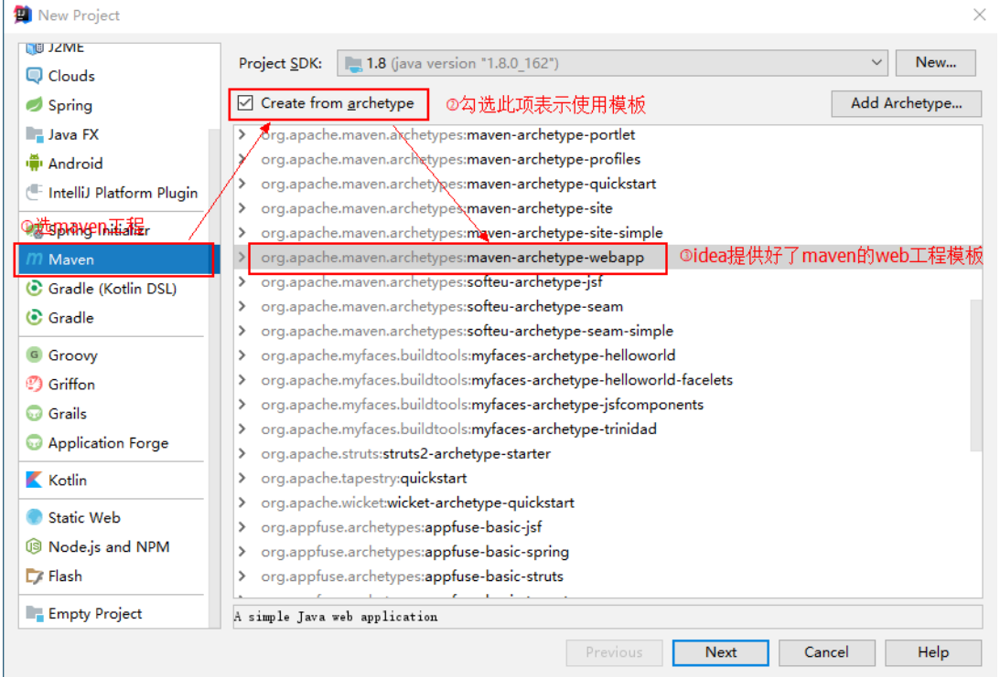

### 3.填写项目信息

> 点击 Next 填写项目信息

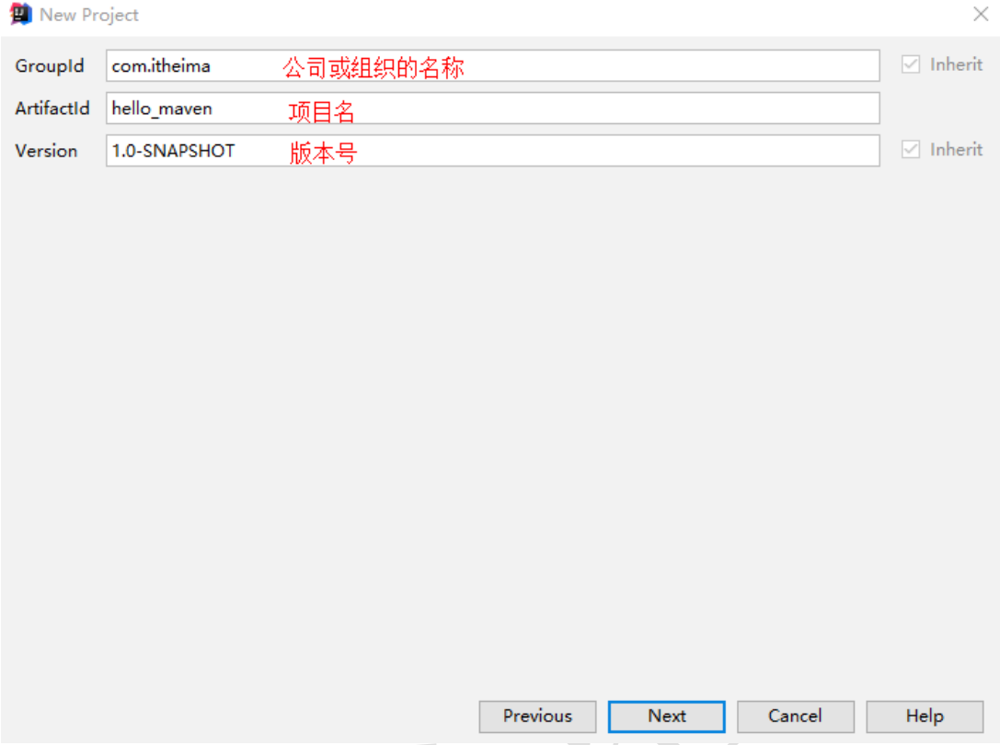

### 4.maven相关配置

> maven相关配置，点击 Next，此处不做改动。

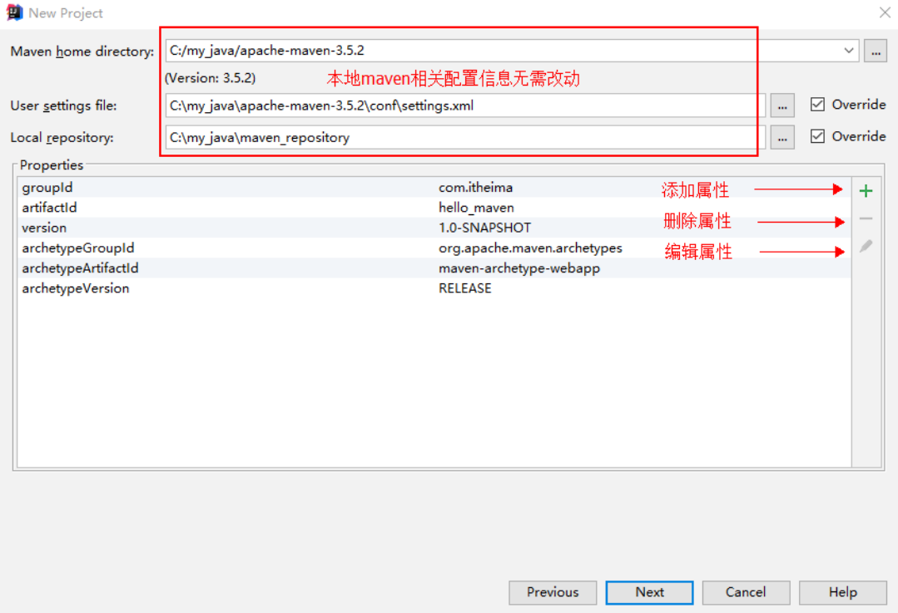

### 5.选择项目所在目录

> 点击 Next 选择项目所在目录

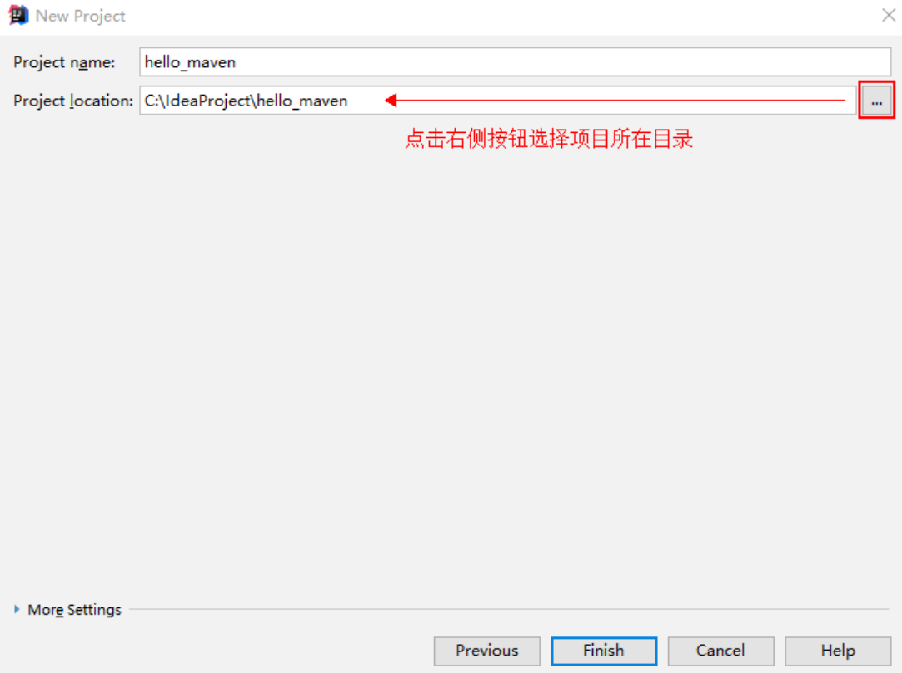

### 6.成功创建工程

> 点击 Finish 后开始创建工程，耐心等待，直到出现如下界面。

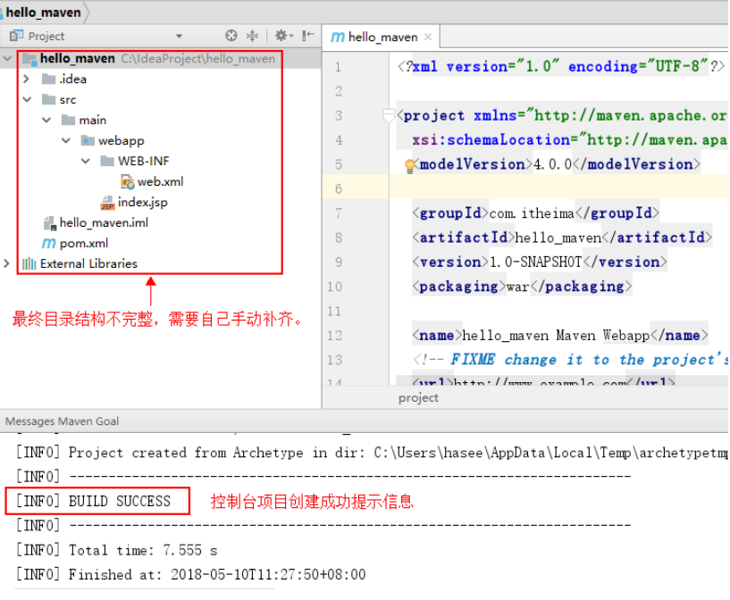

### 7.补全目录

> 手动添加 src/main/java 目录，如下图右键 main 文件夹NewDirectory
> 
> 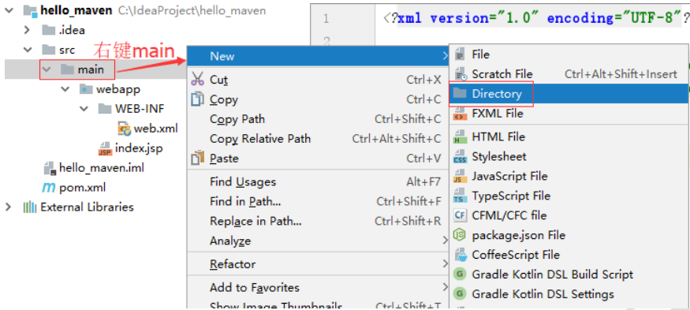

### 8.创建 java 目录

> 创建一个新的文件夹命名为 java

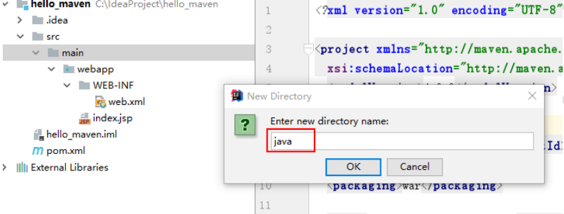

### 9.给java目录设置源

> 点击 OK 后，在新的文件夹 java 上右键Make Directory asSources Root

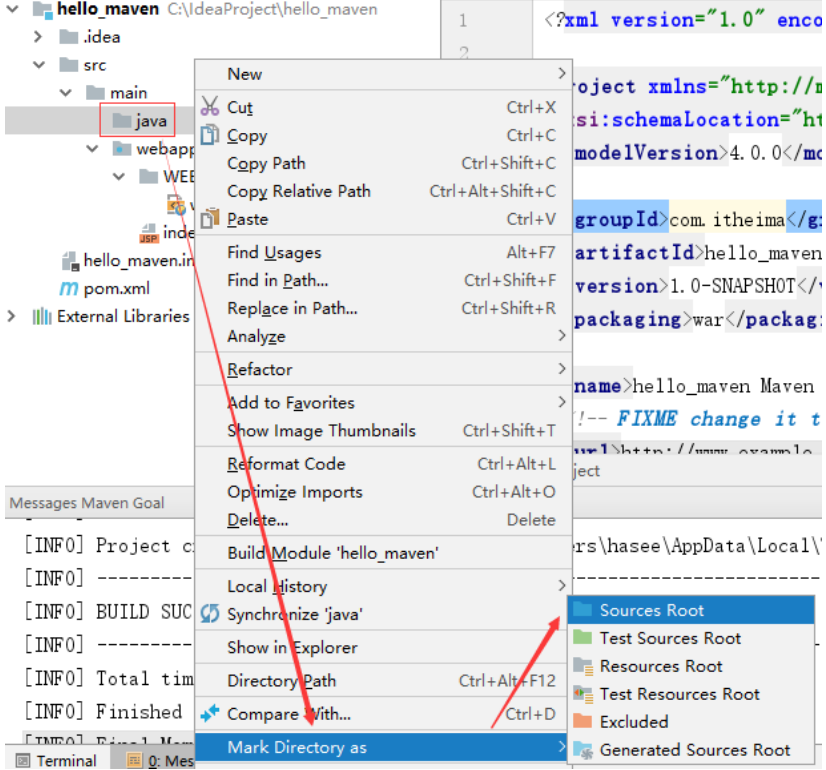

### 10.创建一个 Servlet

> src/java/main 创建了一个 Servlet，但报错，要解决问题，就是要将 servlet-api-xxx.jar 包放进来，作为 maven 工程应当添加 servlet 的坐标，从而 导入它的 jar

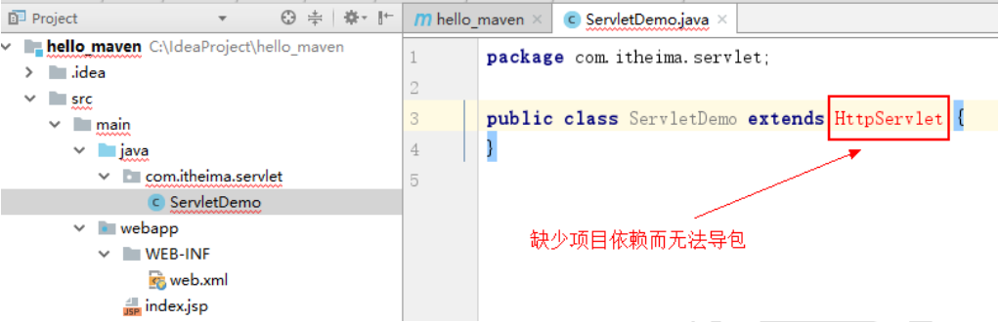
