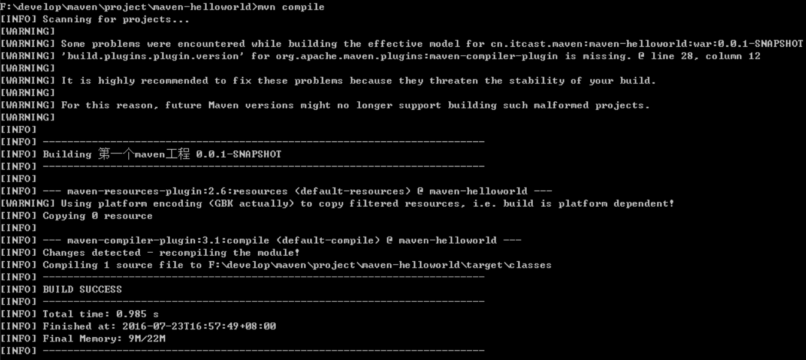

## 常用的 maven 命令

- compile：编译
- clean：清理
- test：测试
- package：打包
- install：安装

## compile：编译

compile 是 maven 工程的编译命令，作用是将 src/main/java 下的文件编译为 class 文件输出到 target 目录下。

cmd 进入命令状态，执行 `mvn compile`，如下图提示成功：

查看 target 目录，class 文件已生成，编译完成。

## clean：清理

clean 是 maven 工程的清理命令，执行 clean 会删除 target 目录及内容。

## test：测试

test 是 maven 工程的测试命令 mvn test，会执行 src/test/java 下的单元测试类。

cmd 执行 `mvn test` 执行 src/test/java 下单元测试类，下图为测试结果，运行 1 个测试用例，全部成功。

## package：打包

package 是 maven 工程的打包命令，对于 java 工程执行 package 打成 jar 包，对于 web 工程打成 war 包。

## install：安装

install 是 maven 工程的安装命令，执行 install 将 maven 打成 jar 包或 war 包发布到本地仓库。

从运行结果中，可以看出： 当后面的命令执行时，前面的操作过程也都会自动执行，

