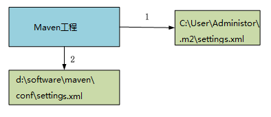

## 全局 setting 与用户 setting

- maven 仓库地址、私服等配置信息需要在 setting.xml 文件中配置，分为全局配置和用户配置。

- 在 maven 安装目录下的有 conf/setting.xml 文件，此 setting.xml 文件用于 maven 的所有 project 项目，它作为 maven 的全局配置。

- 如需要个性配置则需要在用户配置中设置，用户配置的 setting.xml 文件默认的位置在：${user.dir} /.m2/settings.xml 目录中,${user.dir} 指 windows 中的用户目录。

maven 会先找用户配置，如果找到则以用户配置文件为准，否则使用全局配置文件。关系如下：



## 本地仓库地址配置 localRepository 标签

> 不配置默认在windows 中的用户目录：`${user.home}/.m2/repository`

配置样例：

```xml
<!-- localRepository
| The path to the local repository maven will use to store artifacts.
|
| Default: ${user.home}/.m2/repository
<localRepository>/path/to/local/repo</localRepository>
-->
<localRepository>D:/home/repository</localRepository>
```


