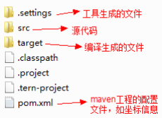
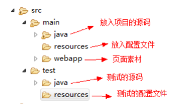
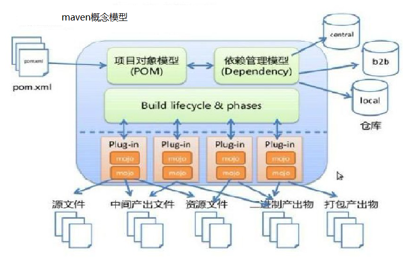

## Maven 工程的目录结构

- src/main/java —— 存放项目的.java 文件
- src/main/resources —— 存放项目资源文件，如 spring, hibernate 配置文件
- src/test/java —— 存放所有单元测试.java 文件，如 JUnit 测试类
- src/test/resources —— 测试资源文件
- target —— 项目输出位置，编译后的 class 文件会输出到此目录
- pom.xml——maven 项目核心配置文件

> 注意：如果是普通的 java 项目，那么就没有 webapp 目录。

## Maven 指令的生命周期

maven 对项目构建过程分为三套相互独立的生命周期，请注意这里说的是“三套”，而且“相互独立”， 这三套生命周期分别是：

- Clean Lifecycle 在进行真正的构建之前进行一些清理工作。

- Default Lifecycle 构建的核心部分，编译，测试，打包，部署等等。

- Site Lifecycle 生成项目报告，站点，发布站点。

## maven 的概念模型

Maven 包含了：
- 一个项目对象模型 (Project Object Model)
- 一组标准集合
- 一个项目生命周期(Project Lifecycle)
- 一个依赖管理系统(Dependency Management System)
- 用来运行定义在生命周期阶段(phase)中插件(plugin)目标(goal)的逻辑。

### 项目对象模型 (Project Object Model)

> 一个 maven 工程都有一个 pom.xml 文件，通过 pom.xml 文件定义项目的坐标、项目依赖、项目信息、插件目标等。

### 依赖管理系统(Dependency Management System)

> 通过 maven 的依赖管理对项目所依赖的 jar 包进行统一管理。

.png)

### 一个项目生命周期(Project Lifecycle)

> 使用 maven 完成项目的构建，项目构建包括：清理、编译、测试、部署等过程，maven 将这些过程规范为一个生命周期，如下所示是生命周期的各各阶段：

.png)

> maven 通过执行一些简单命令即可实现上边生命周期的各各过程，比如执行 `mvn compile` 执行编译、执行 `mvn clean` 执行清理。

### 一组标准集合

> maven 将整个项目管理过程定义一组标准，比如：通过 maven 构建工程有标准的目录结构，有标准的生命周期阶段、依赖管理有标准的坐标定义等。

### 插件(plugin)目标(goal)

> maven 管理项目生命周期过程都是基于插件完成的。
